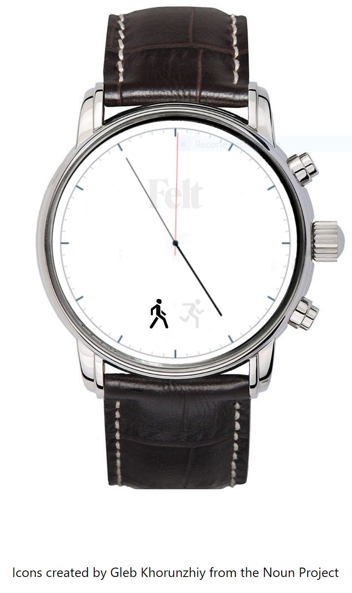

# A simple analog clock in canvas

  

This small project consists of an analog clock, rendered in canvas, with two modes:
* A regular mode that shows the current time with three hands: hours, minutes and seconds
* A stopwatch mode with three hands: minutes, seconds and deciseconds. Notice that this means that the stopwatch is limited to 60 minutes laps. It's a stopwatch for a 100 meters race not for marathons :P

The clock has 3 buttons. The top one is used to start/pause the stopwatch while in that mode, the bottom one is used to reset the stopwatch while in that mode and the middle one is used to change between the regular and stopwatch modes

You can see it live [here](https://ibesora.github.io/canvas-clock/)